# Configure API

## Platform

Go to to https://console.cloud.google.com/ and connect with a google account.

## Creation of a project

+ Click on `Select a project` then `NEW PROJECT`

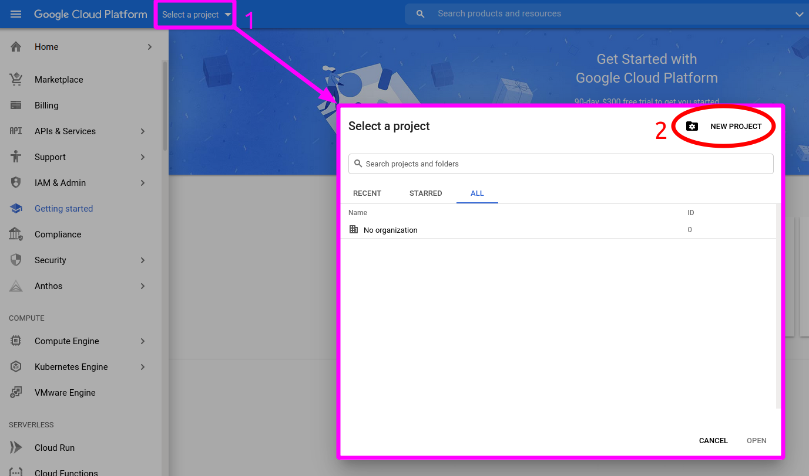

+ Choose a name and create it

 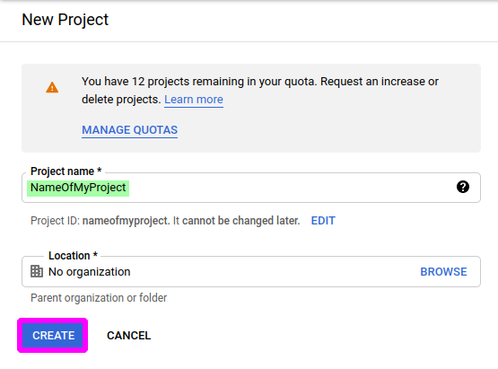

+ You should see a notification which says that the project has been correctly created

 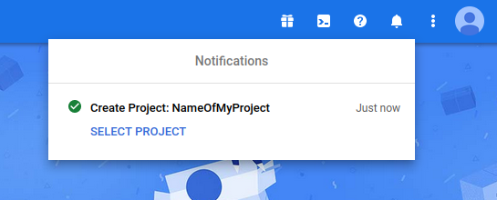

## Adding Google People API

+ Go to API Dashboard

 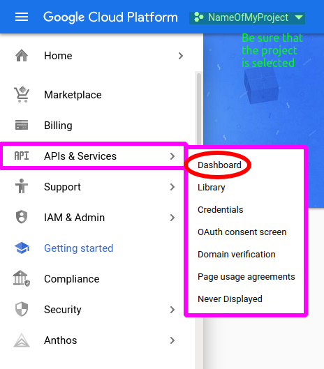

+ Click on `+ Enable APIS AND SERVICES`

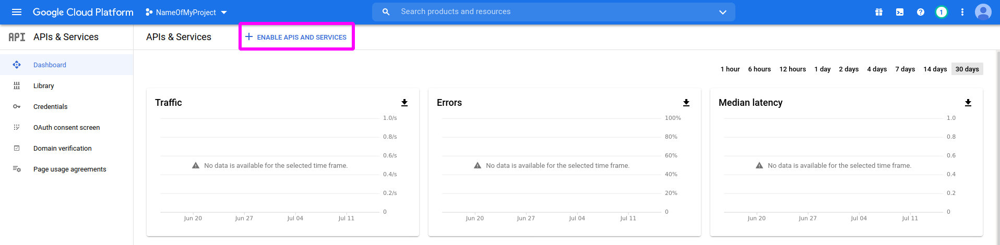

+ Search for `Google People API`

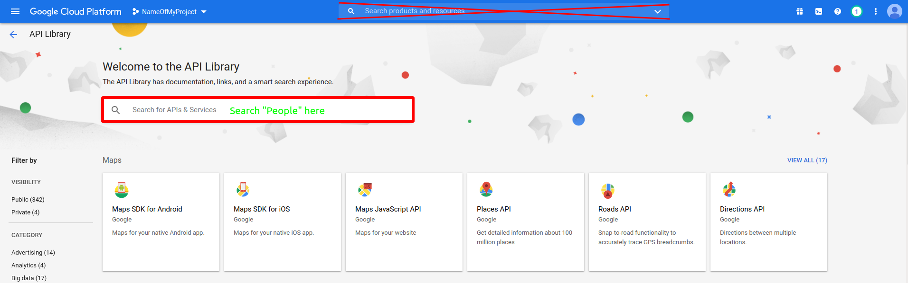

+ Click on the first result

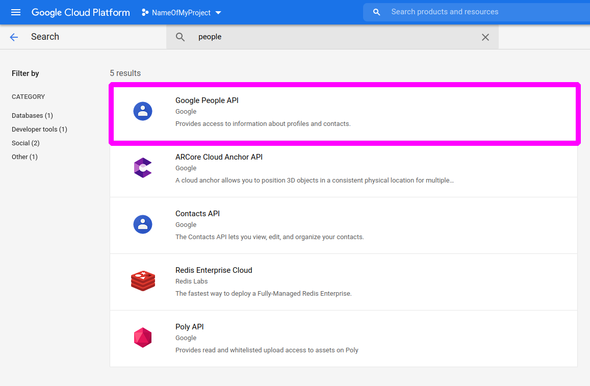

+ Enable `Google People API`

 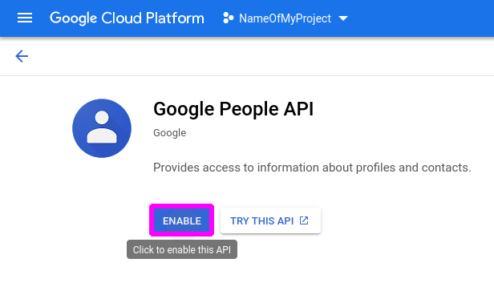

+ You should see a notification which says that the API has been correctly enabled

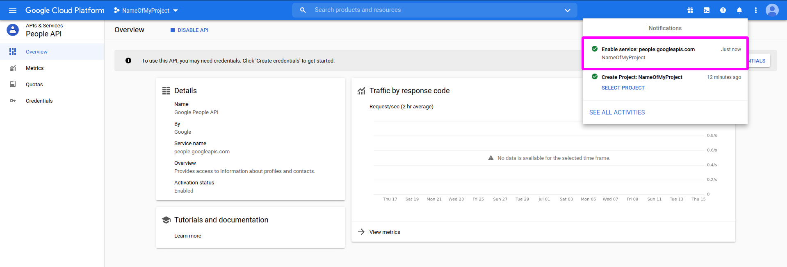

## Configuration of the API

+ Go back to API Dashboard and click on `OAuth consent screen`. You will be asked to choose a `User Type`. Select `External`

 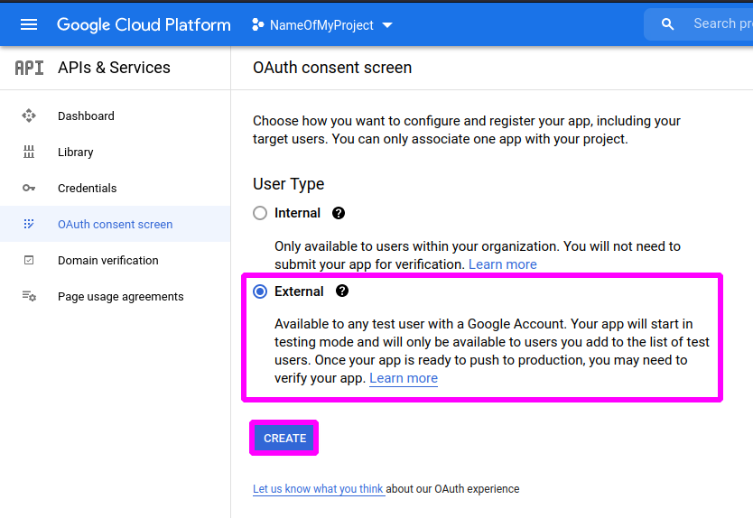

+ Fill the `OAuth consent screen` forms with your informations

 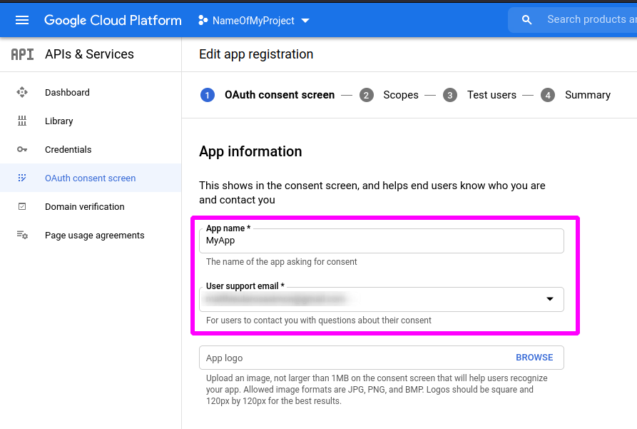

 

+ Pass the `Scopes` forms

 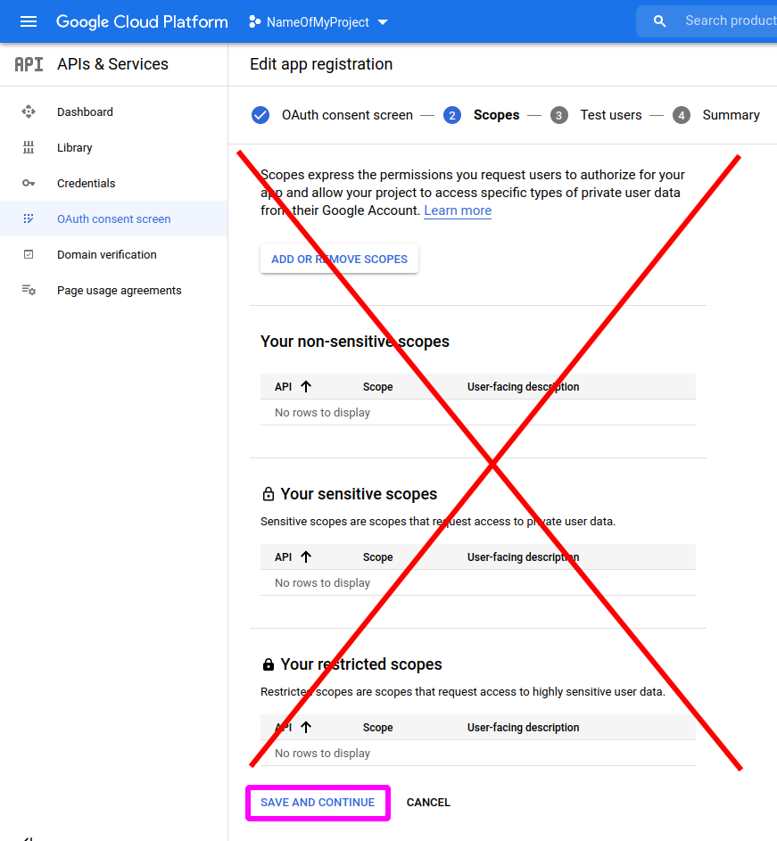

+ Add a test user

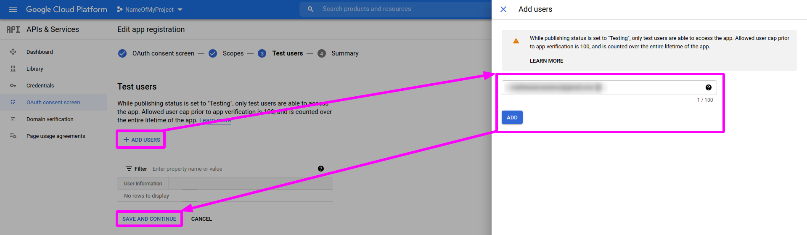

+ Click `Back to dashboard` on `Summary` panel

## Getting credentials

+ In the `CREDENTIALS` panel, in menu `CREATE CREDENTIALS` select  `Create OAuth client ID` 

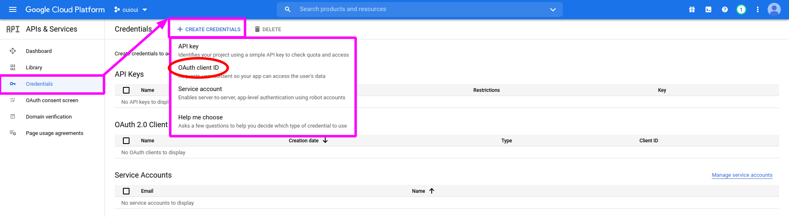

+ Configure `OAuth` for `Desktop app` then create it

 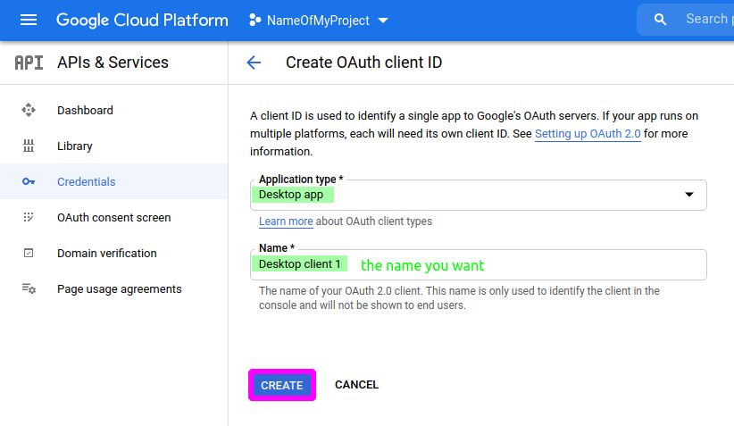

+ Click on `DOWNLOAD JSON`, rename the file `credentials.json` and place it in the same folder as the project

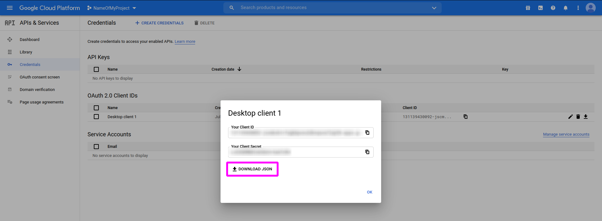